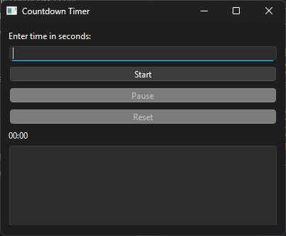

# Countdown Timer

A simple yet powerful **Countdown Timer** built using **Python** and **PyQt6**, featuring:
- **Graphical User Interface (GUI)** with PyQt6
- **Pause, Resume, and Reset** functionality
- **System Notifications** (Windows, Linux, macOS) using `player`
- **Alarm Sound** when time is up (Windows only)
- **Countdown History Log**
- **Validation** for user input

---

### Features
- **Start a countdown** by entering seconds.
- **Pause/Resume** the countdown at any time.
- **Reset** the timer to start a new session.
- **Automatic system notification** when the countdown reaches zero.
- **Alarm sound alert** (Windows only, ignores errrors on other systems).
- **Countdown history log** for tracking completed timers.

---

### How to Run
1. Install Dependencies
Make sure you have Python installed. Then install the required libraries:
```
pip install pyqt6 plyer
```
2. Run the Script
Execute the countdown timer with:
```
python main.py 
```
for CLI, and
```
python countdown_timer_gui.py
```
for GUI

---

### Requirements
- Python 3.x
- PyQt6 (for GUI)
- Plyer (for system notifications)
- Winsound (for alarm, Windows only)

---

### Screenshot
